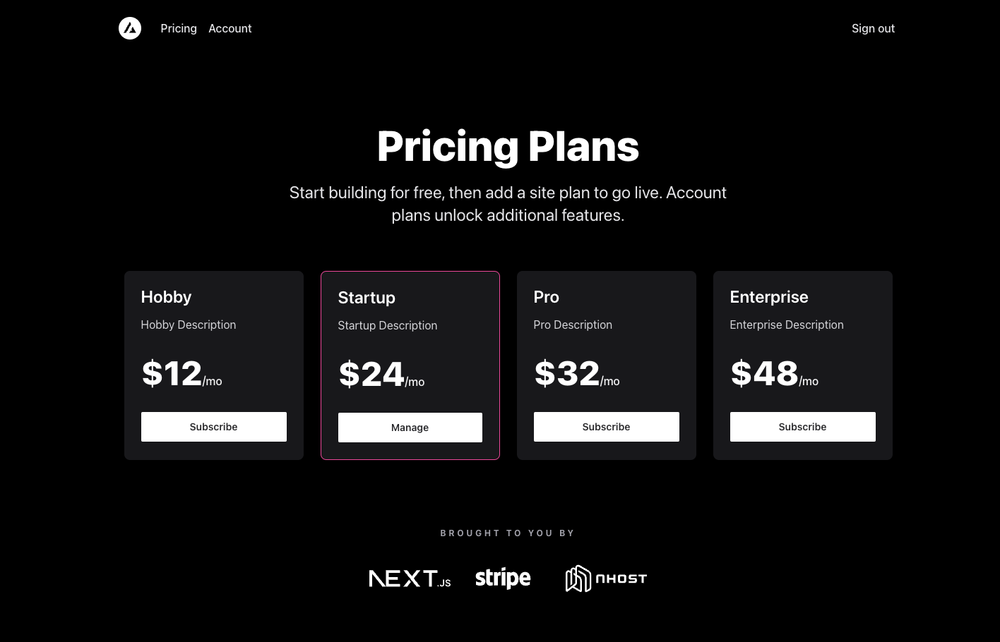

# Next.js Stripe SaaS Starter

The ultimate starter kit for high-performance SaaS applications.

## Features

- Secure user management and authentication with [Nhost](https://docs.nhost.io/authentication).
- Powerful data access & management tooling on top of PostgreSQL with [Nhost](https://docs.nhost.io/database).
- Integration with [Stripe Checkout](https://stripe.com/docs/payments/checkout) and the [Stripe customer portal](https://stripe.com/docs/billing/subscriptions/customer-portal).
- Automatic syncing of pricing plans and subscription statuses via [Stripe webhooks](https://stripe.com/docs/webhooks).

## Features

- Postgres Database
- GraphQL API
- Magic Link and GitHub Authentication
- Email Templates
- Remote Stripe GraphQL API
- Next.js
- TypeScript
- Tailwind CSS
- GraphQL Codegen with React Query

## Demo

- [https://nextjs-stripe-starter-template.vercel.app/](https://nextjs-stripe-starter-template.vercel.app/)

## Development Setup

### Nhost

- Clone this repo.
- Copy `.env.local.example` to `.env.development`.
- Add the following environment variables from [Stripe](https://dashboard.stripe.com/test/apikeys) to the `.env.development` file:
  - `NEXT_PUBLIC_STRIPE_PUBLISHABLE_KEY`
  - `STRIPE_SECRET_KEY`

### Stripe (test mode)

- Create 4 products in the [Stripe Dashboard](https://stripe.com/docs/products-prices/getting-started).
- Add the products to the `nhost/seeds/default/001-plans.sql` file. The first time you're starting the Nhost project using `nhost up` the seed script will run and add the data to your `plans` table.

### Stripe Webhooks (test mode)

- Make sure you have the [Stripe CLI](https://stripe.com/docs/stripe-cli) installed.
- Run `pnpm stripe:listen`.
- You'll see an output stating the Webhook signing secret starting with `whsec_`.
- Copy the Webhook signing secret to your `.env.development` for `STRIPE_WEBHOOK_SECRET`.

### Frontend and Backend

- Start the backend with `nhost up`.
- Start the frontend with `pnpm dev`.

You now have a fully working backend and frontend with Next.js, Nhost, and Stripe.

## Go Live

### Nhost

- Add the following [environment variables](https://docs.nhost.io/platform/environment-variables) from [Stripe](https://stripe.com/docs/keys#test-live-modes) (using live mode):
  - `STRIPE_SECRET_KEY`
  - `STRIPE_WEBHOOK_SECRET`
- Connect your Nhost project to your [Git repository](https://docs.nhost.io/platform/git).
  - This will create the tables automatically for you.

### Stripe (live mode)

- Create 4 products in the [Stripe Dashboard](https://stripe.com/docs/products-prices/getting-started) (live mode).
- Add the products to the `plans` Plans database in the Nhost Dashboard.

### Stripe Webhooks (live mode)

- Add a [webhook endpoint in Stripe](https://dashboard.stripe.com/webhooks) pointing to `https://{subdomain}.functions.{region}.nhost.run/v1/webhook/stripe`.
- Configure the events you want to listen to. It's OK to listen to all events.
- Copy the "Signing secret" and add it as an [environment variable](https://docs.nhost.io/platform/environment-variables) in Nhost with the name `STRIPE_WEBHOOK_SECRET`.

### Frontend Hosting

You can use any frontend hosting, like [Vercel](https://vercel.com/) and [Netlify](https://netlify.com/). The process is the same:

- Connect the repo with a new project in the frontend hosting service.
- Add the following:
  - `NEXT_PUBLIC_NHOST_SUBDOMAIN` (from Nhost)
  - `NEXT_PUBLIC_NHOST_REGION` (from Nhost)
  - `NEXT_PUBLIC_STRIPE_PUBLISHABLE_KEY` (from Stripe)
- Retrigger a deployment so the newly added environment variables are applied.
